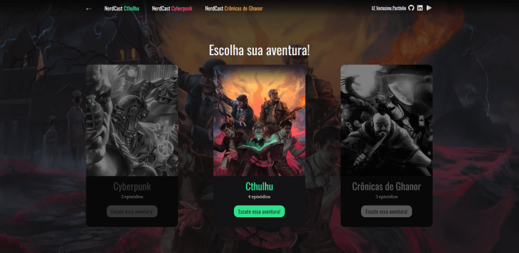
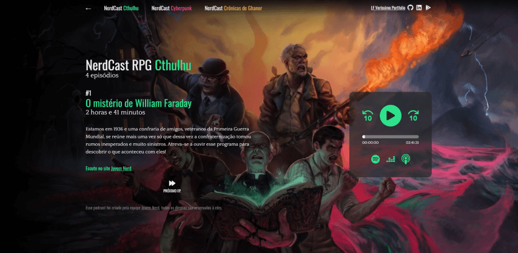
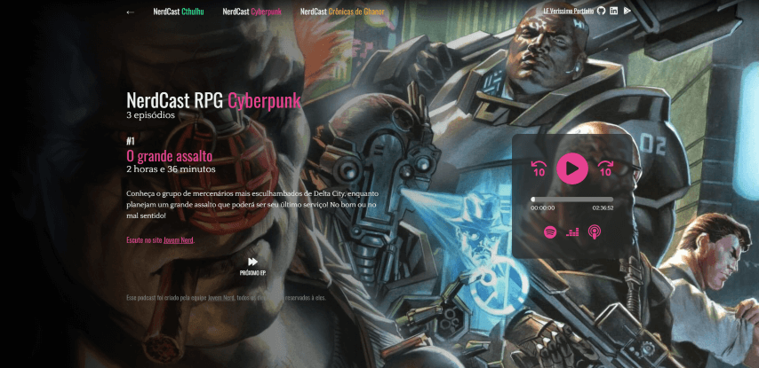
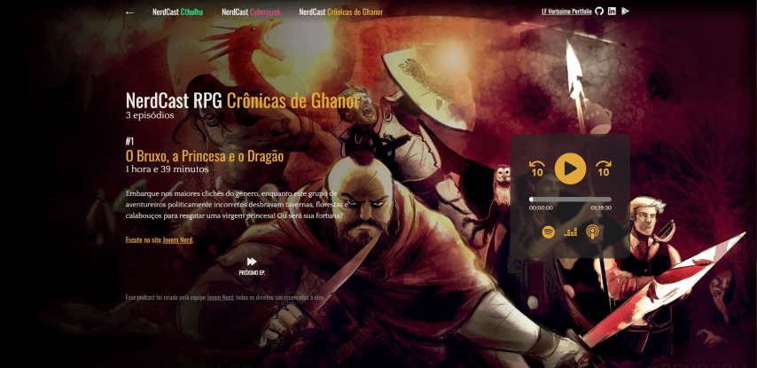

<p align="center">
  
</p>

<h1 align="center">NerdCast RPG - Player ⚔</h1>
<p>
  
  <a href="#" target="_blank">
    
  </a>
</p>

>  Landing page for the NerdCast of RPG from Jovem Nerd. Created with React with Next.js and Tailwind CSS.

### 🏠 [Homepage](https://github.com/luizfverissimo/nerdcast-rpg-player)

### ✨ [Demo](https://nerdcast-rpg-player.vercel.app/)

## Printscreens

    

## Install

```sh
yarn install # or npm install
```

## Usage

```sh
yarn dev # or npm run dev
```

## Author

[](https://lfverissimo.com)

* Website: https://lfverissimo.com
* Github: [@luizfverissimo](https://github.com/luizfverissimo)
* LinkedIn: [@lfverissimo](https://linkedin.com/in/lfverissimo)

## Show your support

Give a ⭐️ if this project helped you!

***
_This README was generated with ❤️ by [readme-md-generator](https://github.com/kefranabg/readme-md-generator)_